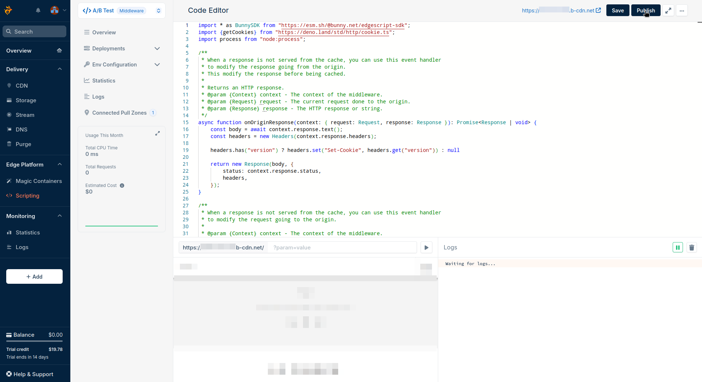

The `A/B Testing`, also called `Split Testing`, is a useful mechanism to know the impact of changes on the users. Often used by the marketing teams, it's based on a very simple idea: serving 2 different versions (A and B) of a website/application to the users. We observe then the evolution of some well-chosen `KPIs` (Key Performance Indicators) which can be the average price of carts, the bounce rate, the mean visit time, etc.

To test changes, and avoid possible massive impacts, most of the users are directed to version A, the current one, and just a few are directed to version B, the new one we want to test. This percentage can be modified over time, and may even allow the use of the system as a migration method.


It exists a lot of methods to perform `A/B Tests`, either on the client-side, either on the server-side. With Edge Scripting, we'll create a kind of "in-middle" version by adding the relevant `HTTP Header` to split the traffic between the two versions at the `Bunny CDN` level.


## Edge Scripting

`Edge Scripting` allows extending up to infinity the tweaking of our `Bunny CDN` by running scripts on the nodes. Built on `Deno`, the infamous open-source JavaScript runtime for the modern web, the solution brings to our adopters amazing features:

- Minimum latency: by executing the process close to the end users
- Simplicity: an online coding environment and well-designed `SDK` are provided, to quickly, test and deploy
- Extensibility: any use case can be tailored-made just with a few lines of code

The `Edge Scripts` can act as "middlewares", and transform the requests and responses on the fly. We'll use this feature to inject a randomly generated `HTTP Header` that the application will be able to use to know which version to serve to the client. 

To know more how to get started with the `Edge Scripting` service, please read the official [quickstart](https://docs.bunny.net/docs/edge-scripting-quickstart).

## A/B Testing Script

We have a few details to consider before implementing the script.

#### Environment variables

Our `Edge Script` will use a few environment variables to get its settings, this will let us change its behaviour without modifying a single line of code:

- **VERSION_A**: the current version of the application, this is the one mostly serve to the clients
- **VERSION_B**: the new version of the application we want to try
- **A_B_RATIO**: the ratio in percent between the 2 versions, `0` means only version A, `100` means only version B, by changing this value over time, we can operate a smooth migration between the versions

#### Cookie and the Header

It's primordial the same user gets the same version of the application over time, for consistency and to be sure to not impact its `UX`. Web applications commonly use a `Cookie` for that, it allows the application to recognize the client, and the reverse proxy to perform a `sticky session`. We'll also use this `Cookie` to inject a Header `Version` with the version into the request. This header deserves multiple purposes, it can either be used to select the version, either used in `logs`, `traces` and `APM` to get the context when debugging.

#### The request/response flow


1/ First visit for the `user`, his request doesn't contain any `Cookie` to select the version of the application to receive.

2/ `Edge Scripting` opens the request and sees that no `Cookie` is present for the version, it randomly picks one version following the configured ratio, and injects the `HTTP header` `Version` into the request. Finally, the request is forwarded to the `origin`.

3/ The origin server responds with the version corresponding to the `HTTP Header` `Version` included in the request.

4/ `Edge Scripting` extracts the `HTTP Headers`, sees the `HTTP header` `Version` is present, injects a `Set-Cookie` header with the version as value to inform the user's browser to record it as a `Cookie` to use for the next requests.

5/ The next requests from the user contain the `Cookie` with the version and allows `Edge Scripting` and the `Origin` to know which version to serve.

#### The script

The `Typescript` script *a_b_testing.ts* we'll use is pretty simple, don't hesitate to extend its features to fit with your usages

```
import * as BunnySDK from "https://esm.sh/@bunny.net/edgescript-sdk";
import {getCookies} from "https://deno.land/std/http/cookie.ts";
import process from "node:process";

/**
* When a response is not served from the cache, you can use this event handler
* to modify the response going from the origin.
* This modify the response before being cached.
*
* Returns an HTTP response.
* @param {Context} context - The context of the middleware.
* @param {Request} request - The current request done to the origin.
* @param {Response} response - The HTTP response or string.
*/
async function onOriginResponse(context: { request: Request, response: Response }): Promise<Response | void> {
    const body = await context.response.text();
    const headers = new Headers(context.response.headers);

    headers.has("version") ? headers.set("Set-Cookie", headers.get("version")) : null

    return new Response(body, {
        status: context.response.status,
        headers,
    });
}

/**
* When a response is not served from the cache, you can use this event handler
* to modify the request going to the origin.
*
* @param {Context} context - The context of the middleware.
* @param {Request} context.request - The current request.
*/
async function onOriginRequest(context: { request: Request }): Promise<Request | void> {
    const cookies = getCookies(context.request.headers);
    if (cookies["version"] == null) {
        if (Math.floor(Math.random() * 100) > process.env.A_B_RATIO) {
            cookies["version"] = process.env.VERSION_A;
        } else {
            cookies["version"] = process.env.VERSION_B;
        }
    }

    context.request.headers.set("version", cookies["version"]);

    return Promise.resolve(context.request);
}

BunnySDK.net.http.servePullZone()
    .onOriginRequest(onOriginRequest)
    .onOriginResponse(onOriginResponse);

```

### Setup

We consider a `Pull Zone` is already set up, with an origin able to serve 2 versions according the `HTTP header` `Version` present in the request.

- Go to `Edge Platform > Scripting` and choose `Deploy and edit on Bunny.net`

  

- Give a name to the script and select `Middleware` as type

  

- Add the Environment Variables with their relevant values

  

- Paste the script

  

- Save and Publish

  

It's done, no more actions are required, you can see all is ready with just a few hops!!

### Tests

Testing the result of our actions is always a good practice, let's do it. We'll use the classic `curl` command for that.

- Without any `Cookie`, we can see that most of the requests get the Version A (75% as configured ratio):
  
  ```
  ❯ curl https://<obfuscated>.b-cdn.net/ -is | grep -i "version"
  version: A

  ❯ curl https://<obfuscated>.b-cdn.net/ -is | grep -i "version"
  version: B

  ❯ curl https://<obfuscated>.b-cdn.net/ -is | grep -i "version"
  version: A

  ❯ curl https://<obfuscated>.b-cdn.net/ -is | grep -i "version"
  version: A

  ❯ curl https://<obfuscated>.b-cdn.net/ -is | grep -i "version"
  version: A
  ```

- Once a `Cookie` is set, only one version is seen:

  ```
  ❯ curl https://<obfuscated>.b-cdn.net/ --cookie "version=B" -is | grep -Ei "(version|set-cookie)"
  set-cookie: B
  version: B

  ❯ curl https://<obfuscated>.b-cdn.net/ --cookie "version=B" -is | grep -Ei "(version|set-cookie)"
  set-cookie: B
  version: B
  ```

The `A/B Testing` works as expected, the `Cookie` ensures the users to be stuck on the same version over and over.

## GitOps

We saw how to manually deploy an `Edge Script` to extend our `CDN`, a good practice is to control everything with `Git` as source of truth, we call that `GitOps`. We provide a provider
for the well known `IaC` (Infrastructure as Code) system: `Terraform`. It can be used to manage all the resources with a consistent and scalable approach. Please read our documentation to know more: https://docs.bunny.net/docs/terraform-overview.

Once you have exported the environment variable `BUNNYNET_API_KEY` to authorize the requests to the `Bunny API`, you can use this `.tf` file to set up everything:

```
terraform {
 required_providers {
  bunnynet = {
   source = "BunnyWay/bunnynet"
   version = "0.6.1"
  }
 }
}

provider "bunnynet" {}

resource "bunnynet_compute_script_variable" "VERSION_A" {
 script    = bunnynet_compute_script.a_b_testing.id
 name     = "VERSION_A"
 default_value = ""
 required   = true
}

resource "bunnynet_compute_script_variable" "VERSION_B" {
 script    = bunnynet_compute_script.a_b_testing.id
 name     = "VERSION_B"
 default_value = ""
 required   = true
}

resource "bunnynet_compute_script_variable" "A_B_RATIO" {
 script    = bunnynet_compute_script.a_b_testing.id
 name     = "A_B_RATIO"
 default_value = "0"
 required   = true
}

resource "bunnynet_compute_script" "a_b_testing" {
 type = "middleware"
 name = "a_b_testing"

 content = file("a_b_testing.ts")
}
```

## Going beyond with Edge Scripting

While we've seen how to smoothly integrate a `A/B Testing` mechanism into our `Bunny CDN` with `Edge Scripting`, the upcoming features we're working on will push the limits way far away. In the upcoming months, we expect to release, among others:

- `Storage integration` – The integration with Bunny Storage will enable the scripts to manage files directly within storage zones. The assets will be directly accessible for the scripts, as read and write, allowing `Edge Scripting` to get configuration files or generate/upload thumbnails for example.
- `Edge Database Lite` - We're working on a globally distributed SQLite-based data storage. It will bring ultra-fast, low-latency data storage to the edge. A use case could be to store the versions and ratio in it to pilot the A/B Testing.